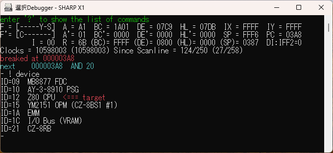
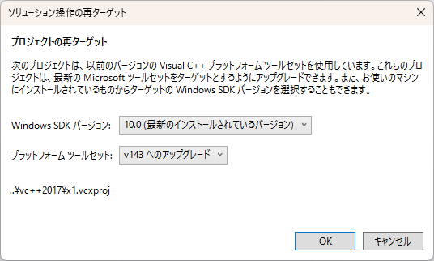
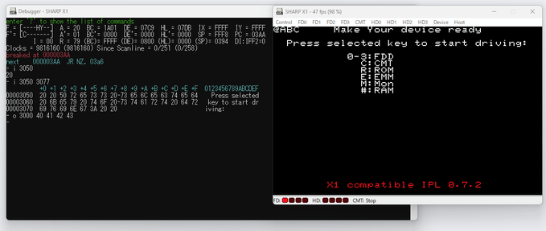
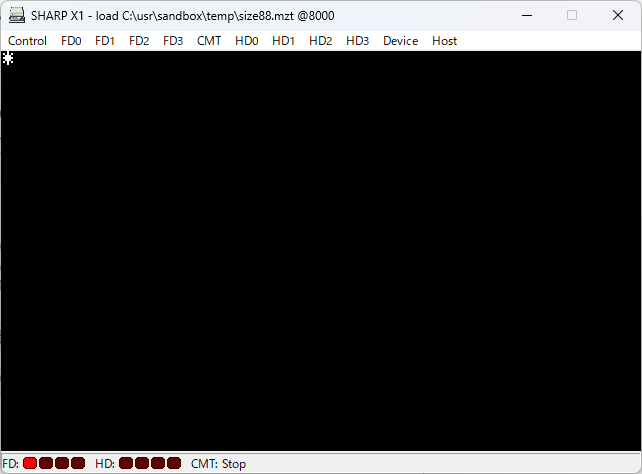

# 武田氏エミュータを機能強化・機能追加するパッチ

## はじめに

武田氏のエミュレータはレトロ PC のソフト開発に大変有用なものなのですが、
少し使いづらく思う点があったので修正を加えて使用しています。
このパッチは多少なりとも役立つと思う方もいらっしゃるかと思い、
その内容を公開するものです。

## 強化・追加内容

- デバッグ機能強化
    - デバッガの I コマンドでアドレス範囲の指定が可能
    - デバッガの O コマンドで複数バイトの指定が可能
	- __【狙い】__ X1 のテキスト VRAM の内容を D/E コマンドのように扱えるようにする
- プログラムロード機能追加
    - MZT ファイルをエミュレータウィンドウにドロップした場合、直接メインモリにロードする
	- __【狙い】__ アセンブル結果をエクスプローラから Drag&Drop して即実行する
    - __【重要】__ 元々 MZT ファイルをドロップ可能なエミュレータの場合、本機能が優先され、元々の機能は無効になります

## 【補足】X1 エミュレータの device

X1 エミュレータでは ! device コマンドでデバイス一覧を表示し、! device ID でそのデバイスを
ターゲットとすることができます。



VRAM は I/O Bus (VRAM) で、これをターゲットとすることで VRAM を D/E コマンドで扱えるのですが、
対象は GVRAM のみで TVRAM は対象外のため、一定の領域の内容を一度に確認することができません。

なお、GVRAM のアドレスは I/O 空間のアドレス（$4000 から）ではなく、$0000 からになっているようです。

```
- ! device
ID=09  MB8877 FDC
ID=10  AY-3-8910 PSG
ID=12  Z80 CPU  <=== target
ID=15  YM2151 OPM (CZ-8BS1 #1)
ID=1A  EMM
ID=1C  I/O Bus (VRAM)
ID=21  CZ-8RB
```


## 組み込み

### 必要なもの

- Microsoft Visual Studio Community 2022
- エミュレータのソース一式
    - [TAKEDA, toshiya's HOME PAGE](http://takeda-toshiya.my.coocan.jp/) を開く
    - Common Souce Code Project を開く
    - Download Source Code Archive (1/1/2024)  のリンクをクリックし source.7z をダウンロードする

### 準備

- source.7z の内容を適当なフォルダに展開する
- デバッグ機能強化の場合
    - 本リポジトリの src\debugger.cpp を 展開先の src\debugger.cpp に上書きする
- プログラムロード機能追加
    - 各機種共通
        - 本リポジトリの src\win32\winmain.cpp.cpp を 展開先の src\win32\winmain.cpp に上書きする
        - 本リポジトリの src\vm\vm_template.h を 展開先の src\vm\vm_template.h に上書きする
    - X1 の場合
        -  本リポジトリの src\vm\x1\x1.* を 展開先の src\vm\x1\ に上書きする
    - MZ-700 の場合
        -  本リポジトリの src\vm\mz700\mz700.* を 展開先の src\vm\mz700\ に上書きする

### ビルド（x1 の場合）

- Visual Studio で 展開先の vc++2017\x1.vcxproj を開く
- ソリューション操作の再ターゲットダイアログが開くので OK を押す 
- メニューから [ソリューション]-[ソリューションのビルド] を選択し、ビルドする
- 展開先の vc++2017\bin\x64\Debug\ に x1.exe ができているので、IPLROM.x1, FNT0808.x1 を用意し、起動する

__【補足】__ x1turbo, x1turboz も vcxproj が異なるだけでソースは共通なので、
ビルドのみで生成可能（のはず）です。

### ビルド（MZ-700 の場合）

- X1 の場合との違いは次のとおり
    - vc++2017\mz700.vcxproj を使用する
    - vc++2017\x1.vcxproj\mz700.exe が実行ファイルとなる
    - MZ-700 の IPL, フォントは別途用意が必要

## 利用方法

- デバッガ機能拡張
    - I コマンド
        - 単一アドレスを指定した場合は従来通りの動作です
        - アドレス範囲を指定すると、D コマンドと同様に表示されます
    - O コマンド
        - 複数のバイトデータを指定可能です
    - 実行例

- プログラムロード機能追加
    - エクスプローラから MZT ファイルを Drag&Drop します
    - 正しくロードされた場合、ファイル名、ロードアドレスをウィンドウタイトルに表示します
	- ロードできなかった場合、エラーメッセージをウィンドウタイトルに表示します


## X1/MZ-700 以外のエミュレータへの適用

- デバッグ機能拡張は機種共通部を修正しているため、自動的に反映されます
- プログラムロード機能追加は、共通部（winmain.cpp, vm_template.h）の他に機種固有部の修正が必要となりますが、おおよそ次の手順で可能なはずです
    - src\vm\機種\機種.h の VM class の定義に load_mzt_into_memory の定義を追加
    - src\vm\機種\機種.cpp に VM::load_mzt_into_memory の実装を追加
- src\vm\x1\x1.h, src\vm\x1\x1.cpp を参考にしてもらえば良いでしょう
- __【訂正】__：共通化は難しく、機種毎に実装対応が必要です。例えば PC-8001/PC8801 の場合、src\vm\pc8801.cpu で次の変更をすることで動作する模様です。


```
//memory->write_data8(addr++, *p++);
pc88cpu->write_debug_data8(addr++, *p++);
```


__機種.h__
```cpp
class VM : public VM_TEMPLATE
{
    (中略)
	uint32_t VM::load_mzt_into_memory(const _TCHAR* file_path);
	// ----------------------------------------
	// for each device
	// ----------------------------------------
	
	// devices
	DEVICE* get_device(int id);
//	DEVICE* dummy;
//	DEVICE* first_device;
//	DEVICE* last_device;
};
```


__機種.cpp__

```cpp
uint32_t VM::load_mzt_into_memory(const _TCHAR* file_path)
{
	const uint32_t LOAD_ERROR = 0xffffffff;

	FILEIO* fio = new FILEIO();

	if (!fio->Fopen(file_path, FILEIO_READ_BINARY)) {
		return LOAD_ERROR;
	}

	unsigned char header[0x80];
	if (fio->Fread(header, sizeof(header), 1) != 1) {
		fio->Fclose();
		return LOAD_ERROR;
	}

	uint32_t data_size = *(uint16_t*)(header + 0x12);
	if (data_size == 0) {
		fio->Fclose();
		return LOAD_ERROR; // no data in mzt
	}
	uint32_t load_addr = *(uint16_t*)(header + 0x14);

	unsigned char *buffer = (unsigned char*)malloc(data_size);

	size_t count = fio->Fread(buffer, data_size, 1);
	fio->Fclose();

	if (count != 1) {
		free(buffer);
		return LOAD_ERROR;
	}

	uint32_t addr = load_addr;
	unsigned char *p = buffer;
	for (int i = 0; i < data_size; i++) {
		memory->write_data8(addr++, *p++);
	}
	free(buffer);
	return load_addr;
}
```

## 保障・ライセンス

- 本パッチで修正した箇所の著作権は放棄します
- 本パッチは無保証です。また何らかの副作用が発生する可能性もある点をご理解・判断の上利用ください
- 利用により何か損害が発生したとしても、その責は負いかねます
- ライセンスは武田氏のライセンスに従います

## 謝辞

高性能、高機能なエミュレータ群を開発・公開されている武田氏に深く感謝します。

## おまけ：mz700.exe の キー対応表

[mz700-key.txt](mz700-key.txt)

MZ-700 のキーとホストのキーボードのキーとの対応を確認した結果です。

| 項目名  | 内容                                                 |
| --      | --                                                   |
| strobe  | $E000 に出力するストローブ値                         |
| bit     | $E001 から入力した値のビット位置                     |
| MZ-700  | MZ-700 のキー名称（後述のMZ-700/1500 I/Oマップより） |
| Windows | Windows キーボードのキー名称                         |
| desc    | Microsoft サイトの VK 定義                           |


__注意__  

- (unbound) はエミュレータでホストのキーを割り当てていないことを表します。
- キーボードレイアウトが「日本語キーボード（106/109キー）」で確認しています。これ以外のレイアウトでは未確認です。
- レジストリで割り当てを変更している場合、異なる挙動を示すことがあるようです。（Ctrl と Caps Lock を入れ替えている場合等）

確認に際し次の情報を参照しました。

- mz700.exe のキーマップ - エミュレータソース src/vm/mz700/keyboard.cpp
- MZ-700 のキー配列 - [MZ-700/1500 I/Oマップ](http://www.maroon.dti.ne.jp/youkan/mz700/mzioframe.html)
- Windows の仮想キー定義 - [Virtual-Key コード](https://learn.microsoft.com/ja-jp/windows/win32/inputdev/virtual-key-codes)


